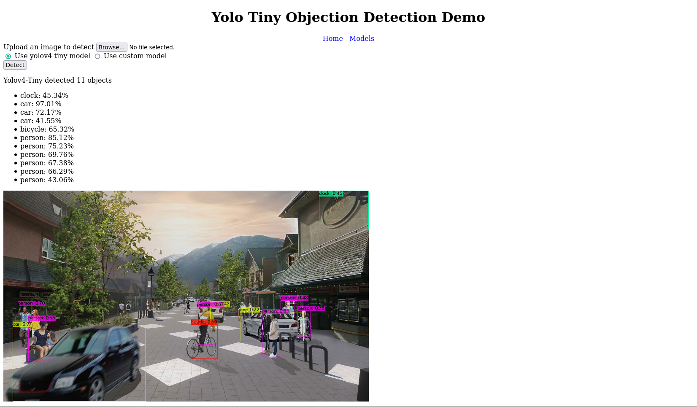

# A web application to demo Yolo object detection

## What is it?
The application enables user to upload their image and it will detect objects in it using one of the two models:

1. The pretrained yolov4 tiny network
2. A finetuned network from yolov4 tiny to detect 5 animals: cheetah, chimpanzee, lion, hog deer, and sun bear.

## How to use

1. Clone the repository
2. Make sure you can build [darknet](https://github.com/AlexeyAB/darknet)
3. Run install.sh
4. `pip install flask`
5. `cd web-demo`
6. `flask run`
7. Open the url displayed on the terminal in a browser if it doesn't open automatically

